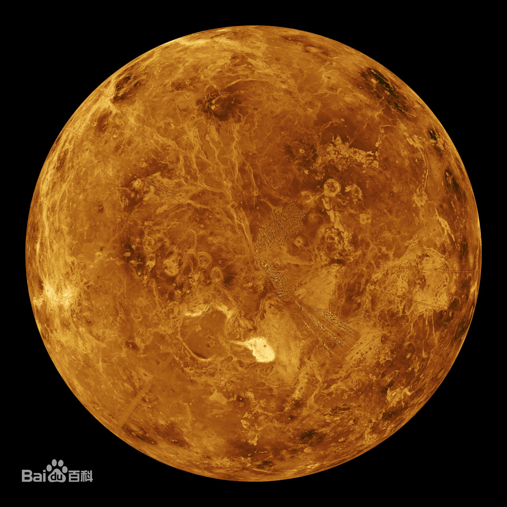

## 金星（启明星“晨星”/长庚星“昏星”/爱神星）
#### 数据
*    公转周期225天
*    与太阳平均距离0.7AU
*    直径密度均与地球相近
*    地表气压达88个大气压

#### 大气成分
1.   CO2（96%以上）
2.   Ｎ2（3.5%）
3.   SO2、CO、HCl、HF、Ｈ2SO4
    
|高度|大气分层现象|
|----|----|
|32km内|透明洁净的大气|
|32～48km|浓雾区（雾层的成分是浓度很高的硫酸雾滴）|
|48～70km|厚云区|
|70km|薄雾区|

 >   大气中有每分钟20次的放电现象
    大气浓密，很少有陨星撞击的痕迹


#### 地形与地球类似

*60%区域比较平坦*

**北半球有3200km*1600km的高原**

***最高的麦克斯韦山高11000m***

~~金星大峡谷~~

>宽280km，深3km，全长2250km​​​

>赤道附近有疑似火山口的大而浅的圆形圈

#### 无磁场磁层及辐射带
#### 自转方向自东向西
> 太阳系大天体运转“同向性”的唯一例外
> 可能是金星演化过程中受到大天体猛烈撞击​

---
[金星](https://baike.baidu.com/item/%E9%87%91%E6%98%9F/19410?fr=aladdin)





[thunder](./thunder.md)


```
TreeNode*ParamDecList();//28 ParamDecList ::= Param  ParamMore
{
    TreeNode*t=Param();
    TreeNode*p=ParamMore(t);
    if(p!=NULL){
        t->sibling=p;
    }
    return t;
}
cout<<"hello world!"
```
